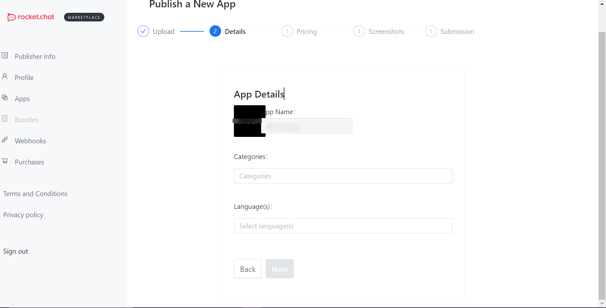
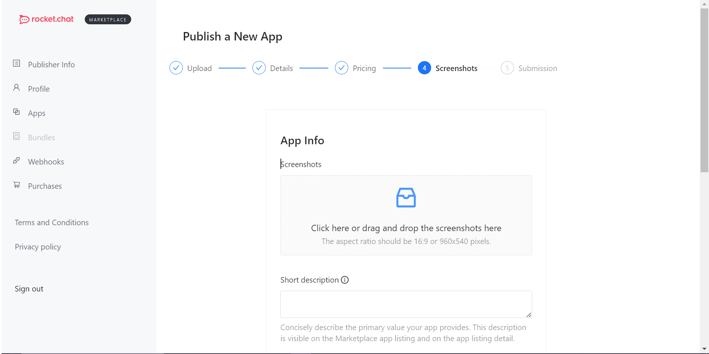
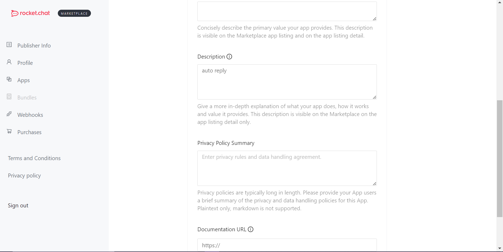
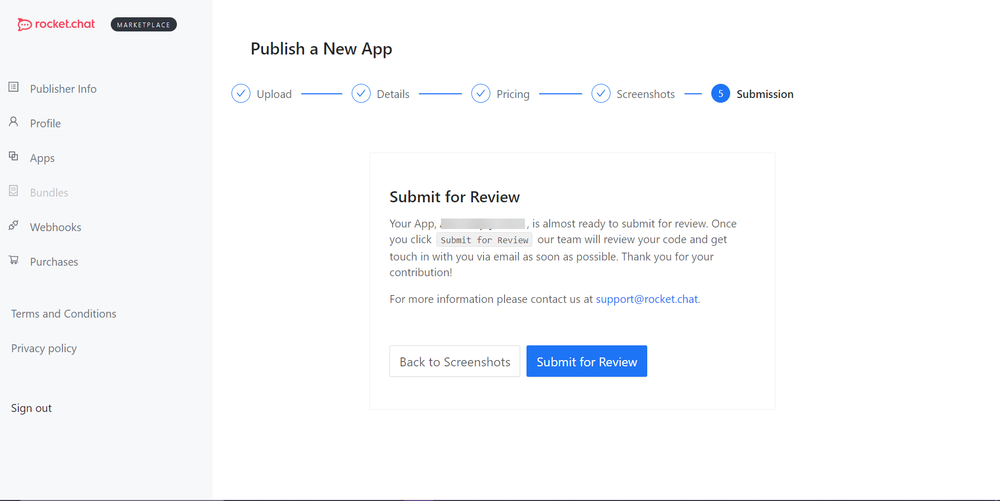

# App Submission to the Marketplace

You have finished [creating your first Rocket.Chat app](../getting-started/creating-an-app.md), and successfully tested it locally. Now, you are ready to submit your app to the marketplace for users to explore.

The following step-by-step guide will take you through the whole process of app submission.

## Package the app

Before submitting your app, you need to package it. Currently, the Rocket.Chat servers and Marketplace allow submission of `zip` files, these files can be created by running the command `rc-apps package` in your apps' directory. This will package your app and create a zip file in the `dist` folder.

## Submit app via CLI

Submission through CLI sends the app in a `draft` state. The publisher must access the portal to be able to submit the app.

### Install a package

```
npm install -g @rocket.chat/apps-cli
```

### App description

The app description file, named `app.json`, contains basic information about the app. You can check the [app-schema.json](https://github.com/RocketChat/Rocket.Chat.Apps-engine/blob/master/src/definition/app-schema.json) file for all the detailed information and fields allowed in the app description file, the basic structure is similar to this:

```json
{
    "id": "5cb9a329-0613-4d39-b20f-cc2cc9175df5",
    "name": "App Name",
    "nameSlug": "app-name",
    "version": "0.0.1",
    "requiredApiVersion": "^1.4.0",
    "description": "App which provides something beneficial for Rocket.Chat users.",
    "author": {
        "name": "Author Name <author@email.com>",
        "support": "Support Url or Email"
    },
    "classFile": "main.ts",
    "iconFile": "beautiful-app-icon.jpg"
}
```

### Upload the app

To upload the app, you need to add the required parameters in the `.rcappsconfig` file already created in the app's directory. It accepts two types of objects:

1. Upload using user name and password:

```typescript
{
    url: string;
    username: string;
    password: string;
}
```

2\. Upload using personal access token and user ID:

```typescript
{
    url: string;
    userId: string;
    token: string;
}
```

### Enable autocomplete for commands

To enable autocomplete for the app CLI, use the command `rc-apps autocomplete <your-shell-type>` with the shell type as `zsh` or `bash` as the supported types. This would provide step-by-step instructions to enable shell completion in your preferred shell.

## Submit app via publisher account

To submit an app to the marketplace, the publisher must have a Rocket.Chat [Cloud Account](https://cloud.rocket.chat/login) and register their publisher account.

### **Create a Rocket.Chat cloud account**

1. Go to [https://cloud.rocket.chat/register](https://cloud.rocket.chat/register) to create your Rocket.Chat Cloud account.
2. Enter your name, email address, and password.
3. Make sure to accept the Rocket.Chat [Terms and Conditions ](https://docs.rocket.chat/legal/terms)and [Privacy Policy](https://docs.rocket.chat/legal/privacy).
4. Click **Next.** You are notified that an email has been sent with the confirmation link to sign in to your cloud console.
5. Next, go to your inbox and confirm your email address by clicking the link we sent; your cloud account has been created and is ready to use.

### **Create a publisher account**

Go to [https://marketplace.rocket.chat/publisher/register](https://marketplace.rocket.chat/publisher/register) to sign up for your publisher account.


After signing up, your publisher developer account is created, as shown below:


### Add your app

To add and submit your app, go to **App** > **New App.**

.png>)

#### **Step 1: Upload your app package**

* Drag and drop your app package or browse your app package `.zip` file and click **Next**.

.png>)

**Step 2: Enter the app details**

Add the required information for the app:

* Set your app's name under **App Name**.
* Use the **Upload new app** button to upload and set a display picture for your app.
* Select a category for your app in the **Categories** drop-down.
* Select a Language for your app in the **Languages** drop-down.
* Click **Next.**

<figure><figcaption><p>App details</p></figcaption></figure>


#### **Step 3: Define the pricing plan**

After entering your app information, the next step is to define the pricing plan and how the users can purchase your app. The pricing model has three types, `One-time purchase`, `Subscription`, and `Free`.

* **Purchase Type** - You can choose how you plan to distribute your app.
* **Price** - Enter the price (USD) that you want to set.
* Click **Next.**


For a paid app, you must connect with a [Stripe](https://stripe.com/) account before submission. You can find more information at [https://stripe.com/docs/payouts](https://stripe.com/docs/payouts).



* **One-time Purchase**: Select **One-time Purchase** when you want your app to have a one-off payment. Your users are allowed to use it forever after that payment.
  * **Price:** Enter the price (USD) you want to set.


Your users are allowed to buy the app per workspace. They must purchase the app separately if they have two workspaces and want to use the app in both.


* **Subscription:** Select the **Subscription** purchase type when you want your app to be subscription-based.
  * Click **Add pricing plan.** A **New Pricing Plan** pane appears.
  * Choose a **monthly** or **yearly** subscription.
  * Enter the **price** (USD) you want to set.
  * Set the number of days for the trial plan.
  * Click **Save** **Plan.**
  * Once done, click **Next.**
* **Free**: Choose this pricing type when you want your app available to your users for free.&#x20;

**Step 4: Screenshots**

* **Screenshot**: Upload some images of your app (1200x600 px, maximum of 5 images).
* **Description**: Set your app's description.
* **Privacy Policy Summary**: Provide your app users with a summary of the app's privacy and data handling policies.



<figure><figcaption><p>Screenshot</p></figcaption></figure>

#### **Step 5: Submission**

Your app is almost ready to submit for review.

* Once you have added the required information, click **Submit for Review.** Our team will review your code and send you a status update via email.



### After app submission

After the successful submission of your app, the following events will happen from Rocket.Chat's side that you should be aware of:

* **Draft**: After you upload your app, you will receive a **draft** status update via email.
* **Compiling**: After we compile, you will receive a **compiled** status update via email.
* **Approval**: Once your app is approved, you will receive an **approved** status update via email, as shown below:


### Publish your app

Once approved, you can go to the portal and publish your app.

To successfully submit an app, you need to follow some guidelines. In the next sections, you can learn about the content and graphic guidelines. You can also see how to register a webhook endpoint link to get updates about your apps.
