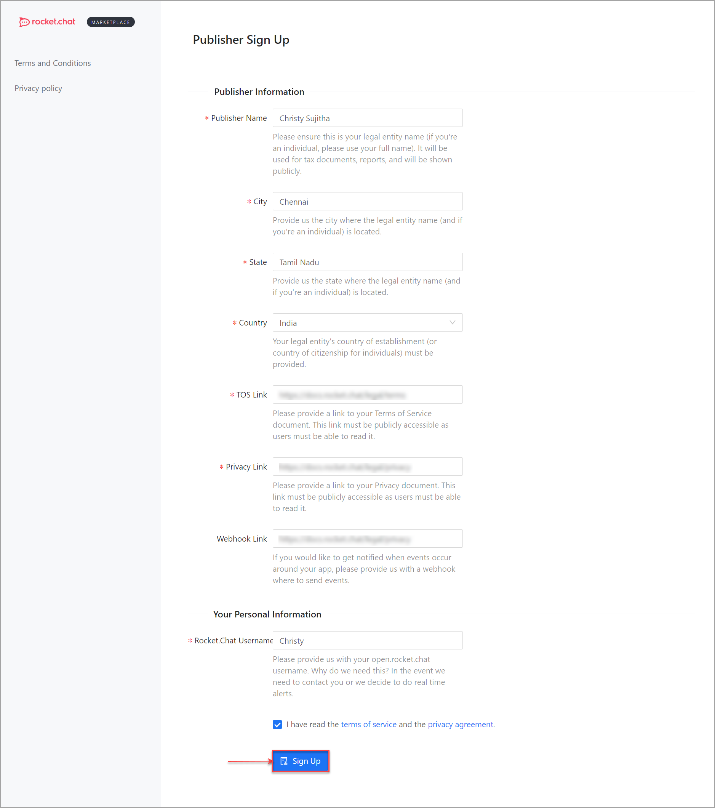

# App Submission to the Marketplace

You have finished creating your first Rocket.Chat App, and successfully tested it locally. Now, you are ready to submit your App to the marketplace for users to explore.

The following step-by-step guide will take you through the whole process of application submission.

## Package the App

Before submitting your App, you need to package it. Currently, the Rocket.Chat Servers and Marketplace allow submission of zip files, these files can be created by running the command `rc-apps package` in your Apps' directory. This will package your App and create a zip file under the `dist` folder.

## App Submission through CLI

Submission through CLI sends the App in a `draft` state. The publisher must access the portal to be able to submit the App.

### Install a package

```
npm install -g @rocket.chat/apps-cli
```

### Develop Rocket.Chat App

#### Logging inside an app

Due to the limitations of NodeJS's `vm` package, we have had to implement a custom logger class. To make usage of this, you can use `this.getLogger()` and then do the normal `console` style logging.

#### `rc-apps create`

The development tools provide a command to quickly scaffold a new Rocket.Chat App, simply run `rc-apps create` and a new folder will be created inside the current working directory with a basic App that does nothing but will compile and be packaged in the `dist` folder.

#### App description

The app description file, named `app.json`, contains basic information about the app. You can check the [app-schema.json](https://github.com/RocketChat/Rocket.Chat.Apps-engine/blob/master/src/definition/app-schema.json) file for all the detailed information and fields allowed in the app description file, the basic structure is similar to this:

```
{
    "id": "5cb9a329-0613-4d39-b20f-cc2cc9175df5",
    "name": "App Name",
    "nameSlug": "app-name",
    "version": "0.0.1",
    "requiredApiVersion": "^1.4.0",
    "description": "App which provides something beneficial for Rocket.Chat users.",
    "author": {
        "name": "Author Name <author@email.com>",
        "support": "Support Url or Email"
    },
    "classFile": "main.ts",
    "iconFile": "beautiful-app-icon.jpg"
}
```

#### Extending the App class

The basic creation of an App is based on extending the `App` class from the Rocket.Chat Apps _definition_ library. Your class also has to implement the constructor and optionally the `initialize` function. For more details on those, check the App definition documentation.

```
import {
    IAppAccessors,
    IConfigurationExtend,
    IEnvironmentRead,
    ILogger,
} from '@rocket.chat/apps-engine/definition/accessors';
import { App } from '@rocket.chat/apps-engine/definition/App';
import { IAppInfo } from '@rocket.chat/apps-engine/definition/metadata';

export class TodoListApp extends App {
    constructor(info: IAppInfo, logger: ILogger, accessors: IAppAccessors) {
        super(info, logger, accessors);
    }

    public async initialize(configurationExtend: IConfigurationExtend, environmentRead: IEnvironmentRead): Promise<void> {
        await this.extendConfiguration(configurationExtend, environmentRead);
        this.getLogger().log('Hello world from my app');
    }
}
```

### Upload the App

For uploading the app, you need to add to the required parameters in the .rcappsconfig already created in the apps directory. It accepts two types of objects:-

1. Upload using username, password

```
{
    url: string;
    username: string;
    password: string;
}
```

2\. Upload using personal access token and userId

```
{
    url: string;
    userId: string;
    token: string;
}
```

### Enable autocomplete for commands

To enable autocomplete for the apps cli use the command `rc-apps autocomplete <your-shell-type>` with the shell type as zsh or bash as the supported types. This would provide a step- by-step instruction to enable shell completion in your preferred shell.

## App Submission through Publisher Account

To submit an app to the marketplace, the publisher must have a Rocket.Chat [Cloud Account](https://cloud.rocket.chat/login) and register their publisher account.

### **Create a Rocket.Chat Cloud Account**

* Go to [https://cloud.rocket.chat/register](https://cloud.rocket.chat/register) to create your Rocket.Chat Cloud account.
* Enter your name, email address, and password.
* Make sure to accept the Rocket.Chat [Terms and Conditions ](https://docs.rocket.chat/legal/terms)and [Privacy Policy](https://docs.rocket.chat/legal/privacy).
* Click **Next.** You are notified that an email has been sent with the confirmation link to sign in to your cloud console.
* Next, go to your inbox and confirm your email address by clicking on the link we sent; your cloud account has been created and is ready to use.

### **Create a Publisher Account**

1. Go to [https://marketplace.rocket.chat/publisher/register](https://marketplace.rocket.chat/publisher/register) to sign up for your publisher account.



Your publisher developer account is created, as shown below:


### Add your App

To add and submit your app, Navigate to **App** > **New App.**


#### **Step 01: Upload**

* Drag and drop your app package or browse your app package .zip file and click **Next**.


**Step 02: Details**

Add the required information for the app.

* Set your app's name under **App Name**.
* Use the **Upload new app** button to upload and set a display picture for your app.
* Select a category for your app in the **Categories** drop-down.
* Select a Language for your app in the **Languages** drop-down.
* Click **Next.**


#### **Step 03: Pricing**

After entering your app information, the next step is to define the pricing plan and how the users can purchase your app. The pricing model has the following three types: One-time purchase, Subscription, and Free.

* **Purchase Type** - You can choose how you plan to distribute your app.
* **Price** - Enter the price (USD)you want to set.
* Click **Next.**


For a paid app it is mandatory to connect with [Stripe](https://stripe.com/) account before submission.



**How do I create a Stripe account?**

* Step 1: Input the [Registration](https://dashboard.stripe.com/register) Page on Stripe.com.
* Step 2: Fill out the form to create an account.
* Step:3 Set up your bank account to receive payouts.

You can find more information here: [https://stripe.com/docs/payouts](https://stripe.com/docs/payouts)


**One-time Purchase**: Select **One-time Purchase** when you want your app to have a one-off payment, and your users are allowed to use it forever after that payment.

* **Purchase Type**: Select **One-time Purchase** to allow the users to make a single purchase.
* **Price:** Enter the price (USD)you want to set.


Your users are allowed to buy the app per workspace. They must purchase the app separately if they have two workspaces and want to use both apps.


**Subscription:** Select the **Subscription** purchase type when you want your app to be subscription-based.

* An example of this volume-based pricing is shown below:


* Click **Add pricing plan.** A **New Pricing Plan** pane appears as shown below.


* Choose a **monthly** or **yearly** subscription\*\*.\*\*
* Enter the **price** (USD)you want to set.
* Set the number of days for the trial plan.
* Click **Save** **Plan.**
* Once done, click **Next.**

Free: Choose this pricing type when you want your app available to your users for free of cost, as shown below:


Click **Free**.

**Step 04: Screenshots**

Include your App screenshots and its description, and also provide your app users a summary of the privacy and policies for the app.

* **Screenshot**: Upload some images of your app (Screenshots (1200x600 px), (max of 5 images).
* **Description**: Set its description\*\*.\*\*
* **Privacy Policy Summary**: Provide your app users with a summary of this app's privacy and data handling policies.


#### **Step 05: Submission**

Your app is almost ready to submit for review.

* Once you have added the required information, click **Submit for Review.** Our Team will review your code and send you a status update via email.


### Process after the successful App submission:

After the successful submission following events will happen at Rocket.Chat side that you should be aware of:

* **Draft**

After you upload your App, you will receive a **draft** status update via email, as shown below:


* **Compiling**

After we compile, you will receive a **compiled** status update via email, as shown below:


* **Approval**

Once your App is approved, you will receive an **approved** status update via email, as shown below:


### Publish your App

Once approved, you can go to the portal and publish your App.
