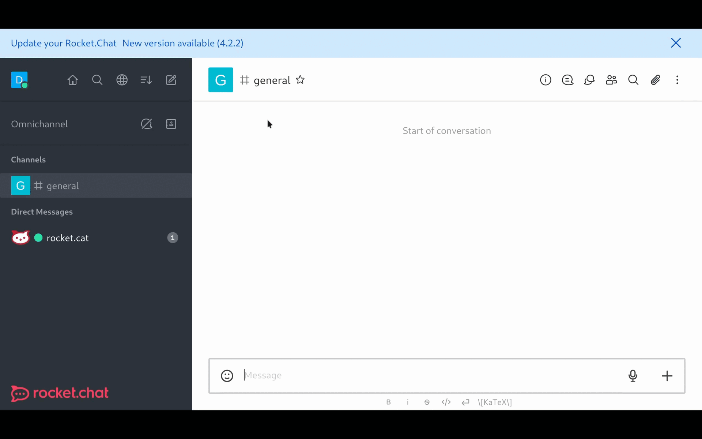

# Creating Your First App

Now, that you've understood the basic concepts of the Apps Engine and installed the CLI, you can create an extremely basic RC App and test it out to understand things. To get started, just recall the commands inside the Apps Engine CLI.

## Creating a new RocketChat App

### Bootstrap Your App

The development tools provide a command to quickly scaffold a new Rocket.Chat App. Simply run `rc-apps create` , give it some details and a new folder will be created inside the current working directory with a basic app that does nothing but will compile and be packaged in the `dist` folder.

Let's create a simple app named `HelloWorld`.

```
[debdut@Rocket apps-engine]$ rc-apps create
Let's get started creating your app.
We need some information first:

   App Name: HelloWorld
   App Description: Says Hello World!
   Author's Name: Jane Doe
   Author's Home Page: n/a
   Author's Support Page: n/a
Creating a Rocket.Chat App in ./helloworld... done!
```

### App description

The basic creation of an App is based on extending the `App` class from the Rocket.Chat Apps _definition_ library. Your class also has to implement the constructor and optionally the `initialize` function, for more details on those check the [App definition documentation](https://rocketchat.github.io/Rocket.Chat.Apps-engine/).

The app description file, named `app.json`, contains basic information about the app. You can check the [app-schema.json](https://github.com/RocketChat/Rocket.Chat.Apps-engine/blob/master/src/definition/app-schema.json) file for all the detailed information and fields allowed in the app description file.

Let's take a look at our `HelloWorld` app's `app.json` file below to understand the structure.

```json
{
    "id": "b0ef0de4-1ee0-4de7-9d16-0f83a75f9dd2",
    "version": "0.0.1",
    "requiredApiVersion": "^1.19.0",
    "iconFile": "icon.png",
    "author": {
        "name": "Jane Doe",
        "homepage": "n/a",
        "support": "n/a"
    },
    "name": "HelloWorld",
    "nameSlug": "helloworld",
    "classFile": "HelloWorldApp.ts",
    "description": "Says Hello World!",
    "implements": []
}
```

### Testing RocketChat App

To test your app, you need a Rocket.Chat server running locally on your machine and access to an admin user's credentials.

See [Installing Rocket.Chat for Developing](../../open-source-projects/server/server-environment-setup/linux.md) to run Rocket.Chat in develop mode. Enable Apps development mode by navigating to **Administration** > **General** then scroll down to **Apps** and click on the `True` radio button over the Enable development mode.

> You can learn more about organizing complex slash commands in our [Sub-command pattern](../recipes/sub-command-pattern.md) recipe

or run it in preview mode with docker using the command:

```
docker run -it --rm -p 3000:3000 -v $(pwd)/rocketdb:/var/lib/mongodb rocketchat/rocket.chat.preview
```

Having the server running, simply run inside the app project's directory:

```
rc-apps deploy --url http://localhost:3000 --username <username> --password <password>
```


Don't forget to enable development mode in General>Apps section of admin settings before run the deploy script!


Where:

`http://localhost:3000` is your local server URL (if you are running in another port, change the `3000` to the appropriate port)

`username` is the username of your admin user.

`password` is the password of your admin user.

If you want to update the app deployed in your Rocket.Chat instance after making changes to it, you can run:

```
rc-apps deploy --url http://localhost:3000 --username user_username --password user_password --update
```


After version 1.9 of the App Engine CLI, the `--update` flag isn't strictly necessary for updating an existing App, you can just run the `deploy` command without it.


### Understanding the App

A Rocket.Chat App is basically a TypeScript file on the root of your project containing a simple class that extends the main `App` class. The name of this file is in your `app.json` file under the `classFile` property.

Let's take a look at our own project's root. You should find a TypeScript file named `HelloWorldApp.ts`.

.png>)

Open the `HelloWorldApp.ts` file. Ignore all the import statements for now. Focus on the main exported class.

```typescript
export class HelloWorldApp extends App {
  constructor(info: IAppInfo, logger: ILogger, accessors: IAppAccessors) {
    super(info, logger, accessors)
  }
}
```

The first thing that you should notice is that the class name is the same as the filename. This is intentional.

For the app to compile successfully, you either have to use the same name for the class and the file or default export the main app class like below:

```typescript
export default class HelloWorld extends App {
  constructor(info: IAppInfo, logger: ILogger, accessors: IAppAccessors) {
    super(info, logger, accessors)
  }
}
```

The most minimal app wouldn't even have a constructor. For example, you can edit the class to:

```typescript
export class HelloWorldApp extends App {}
```

This will compile just fine, and can also be deployed.

But for a functioning app, you need access to a lot of parent property, for which you have to define a constructor. You also have to call the super constructor. For more details as to why, refer to the [TypeScript documentation](https://www.typescriptlang.org/docs/handbook/2/classes.html).

The constructor has three arguments,

1. An `IAppInfo` object: This object contains basic information about your app, like the name, the version, description, etc. It is private to the `App` class but its properties can be accessed via different `get` methods.
2. An `ILogger` object: The logging interface. You can access this object from your child class by using the `getLogger()` method.
3. An `IAppAccessors` object: Object containing all the app accessors. You can access this by using the `getAccessors()` method in your child class.

## Start Developing

Currently, our `HelloWorld` app does nothing. In this section, we'll make it log `Hello, World!` in the Rocket.Chat admin panel.

To log something, you first need access to the logger, or more specifically, access to an object of type `ILogger`. The parent class uses an `ILogger` object to log stuff to the admin panel. We just need access to that object. Unfortunately, the logger object is private to the `App` class and so cannot be accessed directly using `this`.

This can easily be remedied by using the `getLogger` method provided by the `App` class. Simply store the logger in a separate object and then it can be reused any time.

Let's do so now.

```typescript
export class HelloWorldApp extends App {
  private readonly appLogger: ILogger
  constructor(info: IAppInfo, logger: ILogger, accessors: IAppAccessors) {
    super(info, logger, accessors)
    this.appLogger = this.getLogger()
  }
}
```

We have just stored the logger accessor in the `appLogger` variable. Now we can use it to log anything. Add the following line to the constructor.

```typescript
this.appLogger.debug('Hello, World!')
```

Finally the class file looks like:

```javascript
import {
  IAppAccessors,
  ILogger
} from '@rocket.chat/apps-engine/definition/accessors'
import {App} from '@rocket.chat/apps-engine/definition/App'
import {IAppInfo} from '@rocket.chat/apps-engine/definition/metadata'

export class HelloWorldApp extends App {
  public appLogger: ILogger
  constructor(info: IAppInfo, logger: ILogger, accessors: IAppAccessors) {
    super(info, logger, accessors)
    this.appLogger = this.getLogger()
    this.appLogger.debug('Hello, World!')
  }
}
```

You can now deploy it following the instructions provided above.

#### Checking the logs

Now to verify that it actually is working, you need to check the logs.

1. Log in to your Rocket.Chat server as the admin user.
2. Go to `Administration` panel.
3. From the side panel, click on `Apps`.
4.  Now you should see your `HelloWorld` app right there. Click on it.

    
5.  On the right-hand side there is a three-dot button, click on it, and then from the menu click on logs.

    

Scroll down until you see `constructor`. When you do, click on it.

Following screen apears:

 (1) (1).png>)

You just created the simplest Hello World Rocket.Chat app! 😊

### Adding a Slashcommand

Logging to the console is good, but we want our app to interact within a room in Rocket.Chat. In this section we'll make our hello world app send a message in the room you currently have open.

To do this, we're going to use a slash command.

A Slashcommand is a way to call the app installed in Rocket.Chat. Your app can have multiple slashcommands and subcommands. In our example, we will add the `liftoff` slashcommand and it will be called like this by the user inside the chat room:

For this app, let's make the command `hello`. So you should be able to run `/hello` to invoke a function of the app.

```
/hello
```

Although you can have everything in a single file, it is not recommended. Better put each physical component of your app in its own file and even better group the logically similar components in their own subdirectories.

For slashcommand related files, we recommend a subdirectory in your project root named `Commands`, but you are free to choose any other name.

You can create one now in this directory, create a file named `HelloWorldCommand.ts`.

Enter the following line in the file.

```typescript
import ISlashCommand from "@rocket.chat/apps-engine/definition/slashcommands";

export class HelloWorldCommand implements ISlashCommand {}
```

> A SlashCommand is an instance of some class type that implements the `ISlashCommand` interface.


In TypeScript, an interface is a description of an object. It specifies what properties or fields an object must or may have.

When a class implements an interface, it makes a promise that it will conform to the interface's object structure specification.

For example, if an interface looks like this,

`interface Person { name: string; }`

It says any class implementing the `Person` interface **must** have a property of type `string` called `name`. If it doesn't, the file won't compile.

_For more information on TypeScript interfaces, read the_ [_official documentation_](https://www.typescriptlang.org/docs/handbook/2/objects.html)_._


`ISlashCommand` being a non-empty interface, the above `HelloWorldCommand` class is incomplete. It must fulfill its promise of conforming to the structure.

Let's now look at what properties our `HelloWorldCommand` class now must define

`command`

This is a public variable of type `string,` it is the command name of the command you are to enter after the slash. In this case, the value is `hello`.

```typescript
public command: string = 'hello';
```

`i18nDescription`

Description of the app in `i18n` string.

```typescript
public i18nDescription: string = 'Just says Hello to the World!';
```

`i18nParamsExample`

Parameter examples in `i18n` string.

```typescript
public i18nParamsExample = '' // we have no params
```

`providesPreview`

Tells the app whether this command provides command preview or not. We'll talk about command preview in a later section. For now, please use false.

```typescript
public providesPreview: boolean = false;
```

`executor`

This is the method that will be invoked when a user executes the slashcommand. This is where the whole logic and action will take place. When the method is called, it is passed a couple of objects. These arguments define the function signature. It is also documented in the `ISlashCommand` interface.

```typescript
public async executor(
    context: SlashCommandContext,
    read: IRead,
    modify: IModify,
    http: IHttp,
    persis: IPersistence
): Promise<void> {}
```

The executor above doesn't do anything, _yet._

Let's talk about what each parameter type are used for.

* `SlashCommandContext` → An Object containing information about the context around which the command was run. E.g. the user executing the command, the room where the command was executed, command parameters, etc.
* `IRead` → This is an object that provides **read-only** access to the current environment. E.g. room details, user details, app settings, etc.
* `IModify` → An Object that gives you the ability to modify the environment, or actions that _change the environment in some way_. E.g. sending a message, creating a room, deleting a room, etc.

> `IHttp` and `IPersistence` are discussed in a different section.

Your `HelloWorldCommand` class should look like the following now.

```typescript
export class HelloWorldCommand implements ISlashCommand {
    public command = "hello";
    public i18nDescription = "Just says Hello to the World!";
    public providesPreview = false;
    public i18nParamsExample = "";

    public async executor(
        context: SlashCommandContext,
        read: IRead,
        modify: IModify,
        http: IHttp,
        persis: IPersistence
    ): Promise<void> {}
}
```

### Creating a message

_Creating_ any resource in Apps-Engine is a three-step process.

1. First, you need a creator object, namely an instance of `IModifyCreator`.
2. Next for the resource that you want to create, you need a resource builder. A resource builder is basically an object representation of the resource.
3. Finally, call the finish method provided by the creator object. It will take the template object and use it to actually build the resource on the server side.

You can get the creator object by using the `IModify.getCreator` method. In the `executor` method, simply use the `modify` object to get the creator.

```typescript
const creator: IModifyCreator = modify.getCreator();
```

Now we need to create the resource builder, in this case, a message builder. We're going to use `IModifyCreator.startMessage` method for this.

This method will take the message template or an object representation of a message.

A message needs at the very least,

1. The text - visible content
2. A sender - who's sending the message
3. A room - where the message is sent.

We can get the room information from the context.

```typescript
const room: IRoom = context.getRoom()
```

We want our app to send the message, so for the sender, we need the app user. To get the app user information, we need to read our environment, for which an instance of `IRead` or in `executor`, the `read` object is going to be useful.

```typescript
const sender: IUser = (await read.getUserReader().getAppUser()) as IUser
```

Awesome, now we can construct the message template with the content or text being simply, `'Hello, World!'`

```typescript
const messageTemplate: IMessage = {
      text: 'Hello, World!',
      sender,
      room
    }
```

Let's now create the message builder.

```typescript
const messageBuilder: IMessageBuilder = creator.startMessage(messageTemplate)
```

To 'create' the resource, i.e. the message, or more intuitively saying, to 'send' the message, all you need to do now is run the `IModifyCreator.finish` method.

```typescript
await creator.finish(messageBuilder)
```

Combining all these steps, your `HelloWorldCommand.ts` file looks like:

```typescript
import {
  IHttp,
  IMessageBuilder,
  IModify,
  IModifyCreator,
  IPersistence,
  IRead
} from '@rocket.chat/apps-engine/definition/accessors'
import {IMessage} from '@rocket.chat/apps-engine/definition/messages'
import {IRoom} from '@rocket.chat/apps-engine/definition/rooms'
import {
  ISlashCommand,
  SlashCommandContext
} from '@rocket.chat/apps-engine/definition/slashcommands'
import {IUser} from '@rocket.chat/apps-engine/definition/users'

export class HelloWorldCommand implements ISlashCommand {
  public command = 'hello'
  public i18nDescription = ''
  public providesPreview = false
  public i18nParamsExample = ''

  public async executor(
    context: SlashCommandContext,
    read: IRead,
    modify: IModify,
    http: IHttp,
    persis: IPersistence
  ): Promise<void> {
    const creator: IModifyCreator = modify.getCreator()
    const sender: IUser = (await read.getUserReader().getAppUser()) as IUser
    const room: IRoom = context.getRoom()
    const messageTemplate: IMessage = {
      text: 'Hello, World!',
      sender,
      room
    }
    const messageBuilder: IMessageBuilder = creator.startMessage(messageTemplate)
    await creator.finish(messageBuilder)
  }
}
```

### Registering the slashcommand

Once you have your slashcommand ready, you need to let your app know about it.

You do that by overriding the `App.extendConfiguration` method.

The method takes an object of type `IConfigurationExtend`. This object is what we'll have to use to 'extend' our app's configurations.

A configuration is like a feature of an app. They plug into your app.

There are multiple types of configurations, like API endpoints, settings, slashcommands, etc. We will discuss the slashcommands here.

First, let's create our slashcommand. We already have our slashcommand class `HelloWorldCommand`, but that's just the class, or the template or design of the final object, which is the actual slashcommand.

```typescript
const helloWorldCommand: HelloWorldCommand = new HelloWorldCommand()
```

After adding our slashcomamnd logic, we have to register the slashcommand in our app by extending its configuration:

```typescript
await configuration.slashCommands.provideSlashCommand(helloWorldCommand)
```

The final `HelloWorldApp.ts` file looks like:

```typescript
import {
  IAppAccessors,
  IConfigurationExtend,
  ILogger
} from '@rocket.chat/apps-engine/definition/accessors'
import {App} from '@rocket.chat/apps-engine/definition/App'
import {IAppInfo} from '@rocket.chat/apps-engine/definition/metadata'
import {HelloWorldCommand} from './Commands/HelloWorldCommand'

export class HelloWorldApp extends App {
  private readonly appLogger: ILogger
  constructor(info: IAppInfo, logger: ILogger, accessors: IAppAccessors) {
    super(info, logger, accessors)
  }

  public async extendConfiguration(
    configuration: IConfigurationExtend
  ): Promise<void> {
    const helloWorldCommand: HelloWorldCommand = new HelloWorldCommand()
    await configuration.slashCommands.provideSlashCommand(helloWorldCommand)
  }
}
```

## Test the App

Your first app is ready. All that's left is for you to test it! Head over to the[#testing-the-app-1](creating-an-app.md#testing-the-app-1 "mention") section, to deploy your first app to your Rocket.Chat server!


