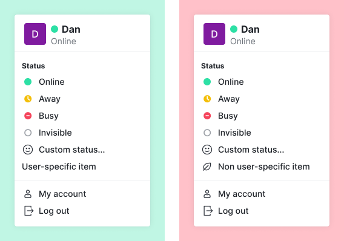
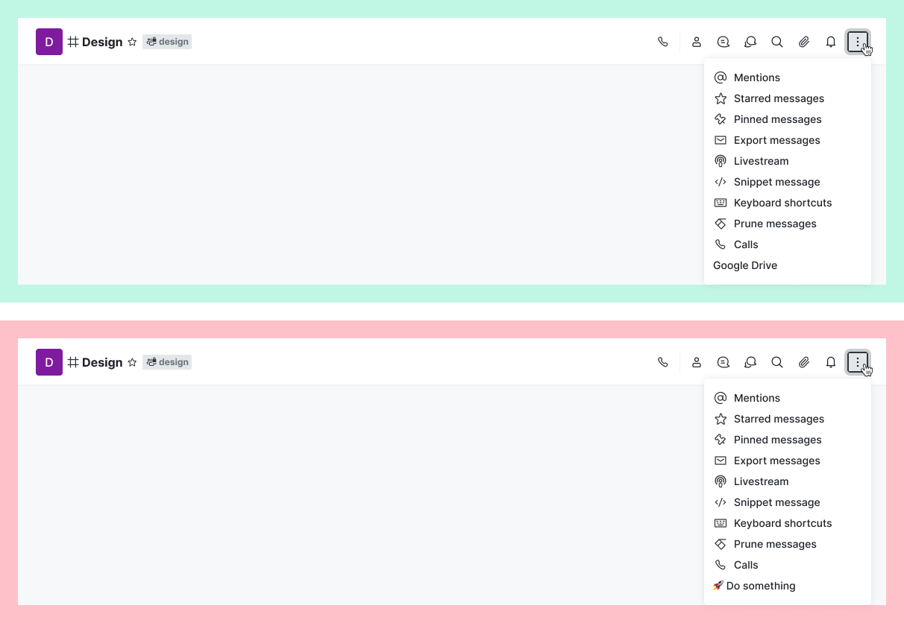
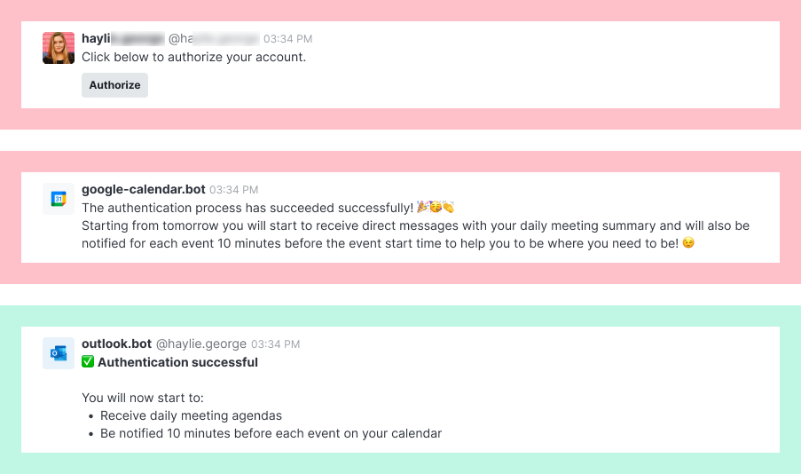
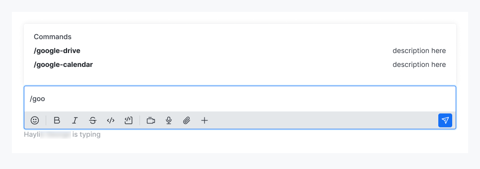
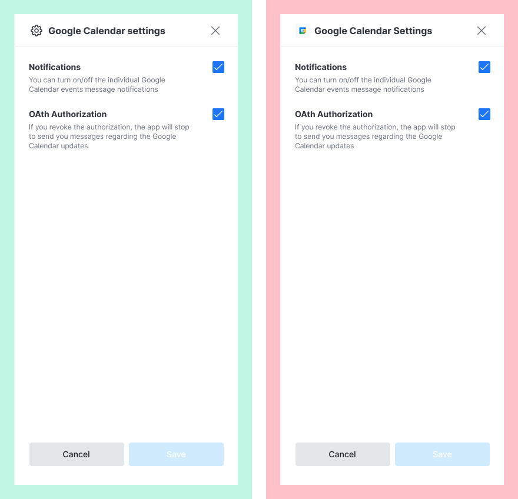
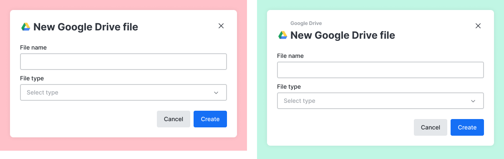

# Surface Guidelines

Follow these guidelines for any interface you are creating for your Rocket.Chat App using the Apps Engine.

## Surface Types

There are two surfaces types:

1. **Simple**: Simple surface types are examples like menus that can contain only the predefined list of menu items
2. **Complex**: Examples like contextual bars and modals which can use all available [UiKit ](broken-reference)components to build the intended user experience.

## User Menu

The user menu contains items specific to the user such as status and preferences. Every item on this menu should relate to a user.

* **Do** add only user-specific items to this menu

<figure><figcaption>
User menu visual guide
</figcaption></figure>

## Room kebab menu

The room kebab menu is located at the top right of any [Rocket.Chat Room](https://docs.rocket.chat/use-rocket.chat/user-guides/rooms).

* This menu opens up a contextual bar and not a modal.
* Items on this menu must relate to or affect the current room or its context in some way.
* **Don't** include icons or use emojis in item labels.

<figure><figcaption>
Room kebab menu UI guide
</figcaption></figure>

## Message kebab menu

The message kebab menu can be seen by the right of a message when hovered upon on a Desktop or long-pressed on a Mobile device.

* The message kebab menu is reserved exclusively for items that affect the selected message.
* Only Rocket.Chat core actions can use icons.
* **Don't** include icons or emoji anywhere inside the item label.

<figure><figcaption>
Message kebab menu UI guide
</figcaption></figure>

## Chat messages

* Make messages very clear, brief, and not long.
* **Do** use an emoji if only they help get the intended message across.
* **Don't** send messages on a user's behalf.
* **Don't** over-communicate or use emojis excessively.

<figure><figcaption>
Chat message UI Guide
</figcaption></figure>

## Slash commands

Slash commands are usually the simplest ways users can interact with installed apps.

* Slash command descriptions should appear by the side of the command when typed in the message composer.
* Commands must have hyphens between words and include a description.

<figure><figcaption>
Slash commands UI Guide
</figcaption></figure>

* All apps using a slash command must have a `/help` command showing the possibilities of the app and it's commands

## Contextual bars

Apps can utilize the contextual bar surface to offer information and actions to the user.

* Contextual bars must contain a corresponding item in the [room kebab menu](ui-guidelines.md#room-kebab-menu).
* Contextual bar titles must use sentence case capitalization eg: `Google Calendar settings` not `Google Calendar Settings.`
* **Don't** use images, such as app icons, inside the contextual bar header.
* **Don't** use titled case in the contextual bar header.
* **Do** use sentence case in contextual bar header.

<figure><figcaption>
Contextual bar UI Guide
</figcaption></figure>

## Modals

Apps utilize modal dialogs to present information and actions to the user. Use [Contextual bars](ui-guidelines.md#contextual-bars) for more complex and involved interactions.

As a default setting, the app logo asset will be presented in modals that are linked to the corresponding app.

* **Don't** use modals without the app name in the tagline.
* **Do** use the app name in the modal tagline.

<figure><figcaption>
Modals UI Guide
</figcaption></figure>

## App (bot) username

If your app has an associated bot user, the username of that user must be identical to the app name except with `-` replacing any spaces in the app name.

Eg if the app is Google Calendar app, the bot username must be _`@google-calendar`_\
Not _`@google-calendar.bot`_ or any other variation.

\
