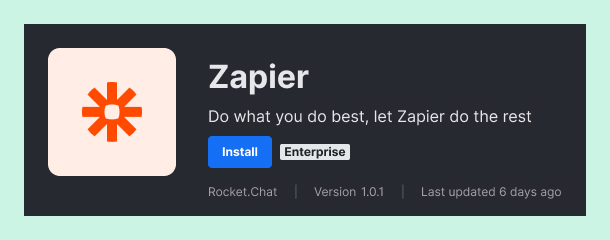
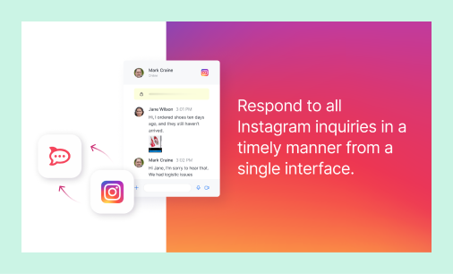

# Assets Guidelines

[Download Figma template](https://www.figma.com/community/file/1223633152022074485)

## App Icons

App icons create the first impression potential users get from your app. A well-designed icon can lead to more downloads by conveying the app's purpose and capturing users’ attention.

The app icon is displayed on:

1. App listing&#x20;
2. App detail
3. Rocket.Chat sidebar

### Specs

Dimensions: 256x256px

Format: JPG, PNG (without transparency)

<figure><figcaption></figcaption></figure>

### Guidelines

**Do** use a simple and recognizable design that conveys the app's purpose.\
**Do** follow the visual guides so the app icon can be read in different contexts.

<figure><figcaption></figcaption></figure>

**Don't** use a complicated or cluttered design that may be difficult to recognize or distinguish. \
**Don't** include the name of your app inside the app icon.

<figure><figcaption></figcaption></figure>

**Do** use a background color.

<figure><figcaption></figcaption></figure>

**Don't** use transparent backgrounds, as the app icon may not have enough contrast to be properly displayed on different themes of Rocket.Chat.

<figure><figcaption></figcaption></figure>

\
**Do** use the visual guides to center your logo within the frame manually.

<figure><figcaption></figcaption></figure>

**Don't** automatically center your logo within the frame; its shapes may require manual adjustments to optimize its optical balance.

<figure><figcaption></figcaption></figure>

##

## App Screenshots

App screenshots help potential users understand what the app does and how it works, which can increase the likelihood of installs. High-quality screenshots can enhance the app's overall branding and improve its perceived quality.

### Specs

Dimensions: 960x540px

Format: JPG, PNG (without transparency)

<figure><figcaption></figcaption></figure>

### Guidelines

**Do** use clear, high-resolution images showcasing the app's features and functionality.

<figure><figcaption></figcaption></figure>

**Don't** use low-quality, blurry, or stretched images that do not present the app accurately or attractively.

<figure><figcaption></figcaption></figure>

**Display** the most important information and features first, using a descriptive and compelling headline highlighting the app's benefits.

<figure><figcaption></figcaption></figure>

**Don't** crowd the screenshots with too much information or use vague or generic headlines.

<figure><figcaption></figcaption></figure>

