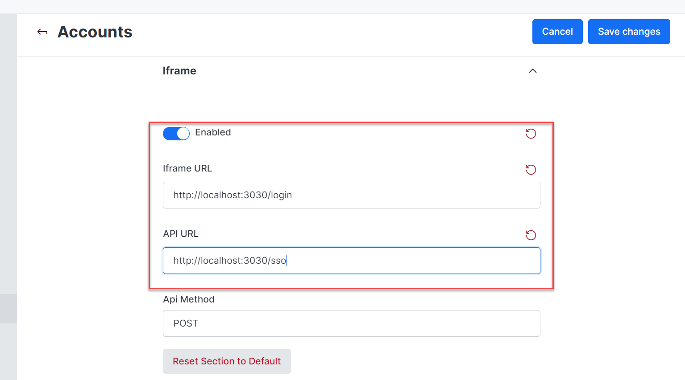

# Adding a Rocket.Chat chat room to your web app

## **Requirements**

Before adding a room to your application, here are some conditions that must be met:

* A running Rocket.Chat server with at least one [room](../../reference/api/rest-api/endpoints/omnichannel/livechat-endpoints/livechat-rooms/).


See the different ways of [deploying](https://docs.rocket.chat/deploy/prepare-for-your-deployment/rapid-deployment-methods) and [configuring](https://docs.rocket.chat/setup-and-configure/accessing-your-workspace) a Rocket.Chat server.


## **Activate the Iframe Integration**

To enable the iframe integration setting in your Rocket.Chat server,

* Navigate to **Administration > Workspace > Settings > Accounts > Iframe.**
* Toggle **on** the **Enabled** option.


It lets you integrate iframes from your Rocket.chat server on other websites/web apps. When iframe integration is enabled in your Rocket.Chat server, you can connect the server to your application.


* Fill in the **iframe URL** with the application URL where you want to integrate the current Rocket.Chat application.
* Add the **API URL**, which is essential for Rocket.Chat to verify that a user is logged into the application. If a user from your application goes to a web page containing the Rocket.Chat Room iframe, the Rocket.Chat server will use this API endpoint to verify the following:
  * The user is identified on your web app.
  * The credentials provided is used to attempt a login into the Rocket.Chat server.
* Click **Save Changes**.

<figure><figcaption></figcaption></figure>


This demo sample uses [http://localhost:3030/](http://localhost:3030/) and assumes the application is running on this port.


* Navigate to  **Administration > Workspace > Settings > General.**
* Disable **Restrict access inside any Iframe.**


Disabling this feature is a security hole in your Rocket.Chat server. It allows anyone to load the Iframe from your server into their app. Enabling it allows only your application's URL to use the Iframe.


* Click **Save Changes**.

## **Iframe Authentication**

The user must have an account and be identified to use the iframe. For authentication, there are two possibilities:

* The user already has a Rocket.Chat account
* The user does not have a Rocket.Chat account

It is essential to know how to manage these cases to ensure Rocket.Chat can identify the user of the iframe.


You can test iframe authentication with our [sample demo on GitHub](https://github.com/RocketChat/iframe-auth-example).&#x20;


### Set up and use the demo code

* Clone the [GitHub repository](https://github.com/RocketChat/iframe-auth-example).

```
git clone 
https://github.com/RocketChat/iframe-auth-example.git
```

* Navigate to the cloned directory and open it in your IDE.

```
cd iframe-auth-examples
```

* Install the demo packages.

```
npm install
```


Do not launch the demo app directly now; you still need to make some modifications!


### **Modifying the demo code**

Before using the demo code, there are still some modifications to do.

* Update the index.js file with this code:

```javascript
//
var express = require('express');
var bodyParser = require('body-parser');
var axios = require('axios');
var fs = require('fs');
var app = express();

app.use(bodyParser.urlencoded({ extended: false }));
app.use(bodyParser.json());

// CORS in case you need
app.use((req, res, next) => {
 res.set('Access-Control-Allow-Origin', 'http://localhost:3000'); // this is the rocket.chat URL
 res.set('Access-Control-Allow-Credentials', 'true');

 next();
});

// this is the endpoint configured as API URL
app.post('/sso', function (req, res) {

 // add your own app logic here to validate user session (check cookies, headers, etc)

 // if the user is not already logged in on your system, respond with a 401 status
 var notLoggedIn = false;
 if (notLoggedIn) {
 return res.sendStatus(401);
 }

 // you can save the token on your database as well, if so just return it
 // MongoDB - services.iframe.token
 var savedToken = null;
 if (savedToken) {
 return res.json({
 token: savedToken
 });
 }

 // if dont have the user created on rocket.chat end yet, you can now create it
 var currentUsername = true;
 if (!currentUsername) {
 axios.post('http://localhost:3000/api/v1/users.register', {
 username: 'new-user',
 email: 'mynewuser@email.com',
 pass: 'new-users-passw0rd',
 name: 'New User'
 }).then(function (response) {

 // after creation you need to log the user in to get the `authToken`
 if (response.data.success) {
 return axios.post('http://localhost:3000/api/v1/login', {
 username: 'new-user',
 password: 'new-users-passw0rd'
 });
 }
 }).then(function (response) {
 if (response.data.status === 'success') {
 res.json({
 loginToken: response.data.data.authToken
 });
 }
 }).catch(function (error) {
 res.sendStatus(401);
 });
 } else {

 // otherwise create a rocket.chat session using rocket.chat's API
 axios.post('http://localhost:3000/api/v1/login', {
 username: 'new-user',
 password: 'new-users-passw0rd'
 }).then(function (response) {
 if (response.data.status === 'success') {
 res.json({
 loginToken: response.data.data.authToken
 });
 }
 }).catch(function() {
 res.sendStatus(401);
 });
 }
});

// just render the form for the user authenticate with us
app.get('/login', function (req, res) {
 res.set('Content-Type', 'text/html');
 fs.createReadStream('login.html').pipe(res);
});

app.get('/home', function (req, res) {
 res.set('Content-Type', 'text/html');
 fs.createReadStream('home.html').pipe(res);
});

// receives login information
app.post('/login', function (req, res) {

 // do your own authentication process

 // after the user is authenticated we can proceed with authenticating him on rocket.chat side

 //
 //
 // the code below is exactly the same as the on /sso endpoint, except for its response
 // it was duplicated for understanding purpose
 // the authentication process and is a well-designed app =)
 //
 //

 // if dont have the user created on rocket.chat end yet, you can now create it
 var currentUsername = null;
 if (!currentUsername) {
 axios.post('http://localhost:3000/api/v1/users.register', {
 username: 'new-user',
 email: 'mynewuser@email.com',
 pass: 'new-users-passw0rd',
 name: 'New User'
 }).then(function (response) {

 // after creation you need to log the user in to get the `authToken`
 if (response.data.success) {
 return axios.post('http://localhost:3000/api/v1/login', {
 username: 'new-user',
 password: 'new-users-passw0rd'
 });
 }
 }).then(function (response) {
 if (response.data.status === 'success') {
 res.redirect('/home')
 }
 }).catch(function (error) {
 res.sendStatus(401);
 });
 } else {

 // otherwise create a rocket.chat session using rocket.chat's API
 axios.post('http://localhost:3000/api/v1/login', {
 username: 'username-set-previously',
 password: 'password-set-previously'
 }).then(function (response) {
 if (response.data.status === 'success') {

 // since this endpoint is loaded within the iframe, we need to communicate back to rocket.chat using `postMessage` API
 res.set('Content-Type', 'text/html');
 res.send(`<script>
 window.parent.postMessage({
 event: 'login-with-token',
 loginToken: '${ response.data.data.authToken }'
 }, 'http://localhost:3000'); // rocket.chat's URL
 </script>`);
 }
 }).catch(function() {
 res.sendStatus(401);
 });
 }
});

app.listen(3030, function () {
  console.log('Example app listening on port 3030!');
});
```

* Create a new file, _home.html,_ in the root directory. Update the _home.html_ with this code:

```html
//
<!DOCTYPE html>
<html lang="en">
<head>
    <meta charset="UTF-8">
    <meta http-equiv="X-UA-Compatible" content="IE=edge">
    <meta name="viewport" content="width=device-width, initial-scale=1.0">
    <title>Document</title>
</head>
<body style="text-align: center;">
    <button style="margin-bottom: auto;" onclick={x()}>GO TO GENERAL</button>
    <iframe src="http://localhost:3000/channel/general/?layout=embedded" title="myframe"></iframe>
</body>
<script>
    function x() {
        document.querySelector("iframe").contentWindow.postMessage(
            {
                externalCommand: "go",
                path: "/channel/general/?layout=embedded"
            },
            "http://localhost:3000"
        );
    }
</script>
</html>
```

When a new user is created, they are redirected to the _home.html_ page.

Navigate to **Administration > Workspace > Settings > Accounts > Iframe**; the API method is `POST`. It must sync with the request methods in our backend for the link added as the API URL.&#x20;

The demo backend for handling the Rocket.Chat server is  `/sso` `POST`  request.

In _index.js_, the `app.post('/sso' ... )` function in the backend only runs once the user has been on the page containing the iframe, which is _home.html_ in the demo. It also verifies that the user is logged in to Rocket.Chat.

The `axios.post('http://localhost:3000/api/v1/users.register'....)` function makes a `POST` request to the Rocket.Chat server API with the user's credentials to create a new user and log the user in to obtain the `authToken`.

The  `axios.post('http://localhost:3000/api/v1/login' ....)` function onwards makes a `POST` request to the Rocket.Chat server API with the user's credentials to create a rocket.chat session for the user.


The login credentials must match those previously entered by the user. For the demo, we will put them back as we created them.


### Launch Demo

Run this command to launch the demo app:

```
npm run start
```

### Demo Code Overview

The demo application is currently running on port `3030`. The  _index.js_ file is the backend of our demo, while _login.html_ is the front end of the demo.

The `POST /login` and `POST /sso` endpoints in _index.js_ are significant for iframe integration.

After receiving the credentials through the form on the front end, pass them through the authentication logic of your application.


The sample demo doesn't have authentication. However, your application should have one to manage users.


When the credentials are passed through authentication in your application, they are used for two purposes:

* They are used to connect to the Rocket.chat app via the Rocket.Chat server `/login` endpoint.


You can copy and paste the demo code into your application.


* If Rocket.Chat has not found a user, it creates one with the identifiers received by your application.

The _home.html_ file has two critical features, which include the following:

* The **button** and the function of the button: See[ fast-loading](adding-a-rocket.chat-chat-room-to-your-web-app.md#enable-disable-embedded-layout) to learn more.
* The **iframe**: When the user arrives on the page, the iframe will load the src of the iframe and call the URL to Rocket.Chat server. Then, Rocket.Chat requests to the SSO endpoint (`http://localhost:3030/sso`). It checks if the user is logged in or not. Once the user is successfully identified, Rocket.Chat stores the token in the database and the user credentials in the users' browser local storage. Now go to _localhost:3030/login,_ enter new credentials, and click Submit.


Use a private browser so the iframe doesn't use the credentials in your local storage and connect to your account instead of the one you are trying to create in the demo app.



### **Enabling fast-loading for the embedded Rocket.Chat room**

Rocket.Chat is designed as a client-side rendered application to ensure a seamless user experience. Upon arrival, the entire application loads in the user's browser, eliminating any loading waits when switching rooms within the application. However, when using an iframe, the experience may differ slightly as there may be some latency when changing rooms within the iframe. To mitigate this, optimize the iframe loading process to ensure that the entire iframe loads completely upon the user's initial visit to the page. Doing so eliminates any latency and provides a smoother user experience for those using Rocket.Chat through an iframe.

Rocket.Chat provides [commands for iframe integration](./). In these commands, there is `postMessage()`. Using this command in your client-side code, the iframe content Window will route the client side to a chat room, making the switching instant without loading.

To use these commands, you must change a setting in your Rocket.Chat server.&#x20;

* Go to **Administration > Settings > General > iframe Integration**
* Toggle on **Enable Recieve**.
* Add the URL of your application that receives commands in the **Receive Origins** field**.** It allows the iframe's parent window to send commands to the Rocket.Chat server. For this demo, use _http://localhost:3030/._
* Once saved, it allows the iframe's parent window to send commands to the Rocket.Chat server.
* In _home.html,_ review the function for clicking the **Go To General** button.

```javascript
document.querySelector("iframe").contentWindow.postMessage(
{
externalCommand: "go",
path: "/channel/general/?layout-embedded"
},
"
http://localhost:3000
 <Your server URL>"
);
```

This command goes directly to the general room of the Rocket.Chat server. Once permission has been enabled in your server, you can change rooms without loading. Now, you can add a chat room to your web app successfully.

## **Use Cases**

Rocket.Chat provides more than the ability to have an embedded room. You can use the application code and server permissions to use specific commands and events the embedded application triggers.

### **Commands: Change your user status**

* Go to _home.html_ and add the `x() function` to the tag script.

```html
const x = () => {
    document.getElementsByTagName("iframe")[0].contentWindow.postMessage({ 
        externalCommand: "set-user-status", 
        status: "away"
    },
    "http://localhost:3000"
    )
}
```

* Replace the `<button>` tag in _home.html_ with this:

```
<button style="margin-bottom: auto;" onclick={x()}>Set away status</button>
```

You can now click on the button in the embedded room and change your status.



### **Events: Adding code for Rocket.Chat iframe events**

Rocket.Chat provides events in the iframe. These events trigger different actions by the user.&#x20;

To enable the sending of iframe events,&#x20;

* Go to **Administration > Settings > General > Iframe Integration.**
* Toggle on **Enable Send**. It allows your Rocket.Chat server to send events to the parent window of the iframe.&#x20;
* In the **Send Target Origin** field, add  `*` or the URL of your application.&#x20;
* Click **Save Changes.**
* In _home.html_ , add this script:

```html
 window.addEventListener('message', function(e) {
    if(e.data.eventName === 'room-opened') {
        alert('You opened a room!')
    }
});
```

* Go to your embedded room, and type #\<ARoomName> in the message field.


* Click **Enter**. If you click the link and open a new room, an alert appears on your screen that you have opened a room.



### **Enable / Disable Embedded Layout**

Currently, the application is in embedded mode. You can only see the room you're in. The left sidebar and room header are not present.

#### **Enable embedded layout**

```
<iframe style="width: 100%; height: 80vh;" src="http://localhost:3000/channel/ChannelTest1/?layout=embedded" title="myframe"></iframe>
```

#### **Disable embedded layout**

```
<iframe style="width: 100%; height: 80vh;" src="http://localhost:3000/channel/ChannelTest1" title="myframe"></iframe>
```

After disabling, you can see the entire Rocket.Chat window in your application.
