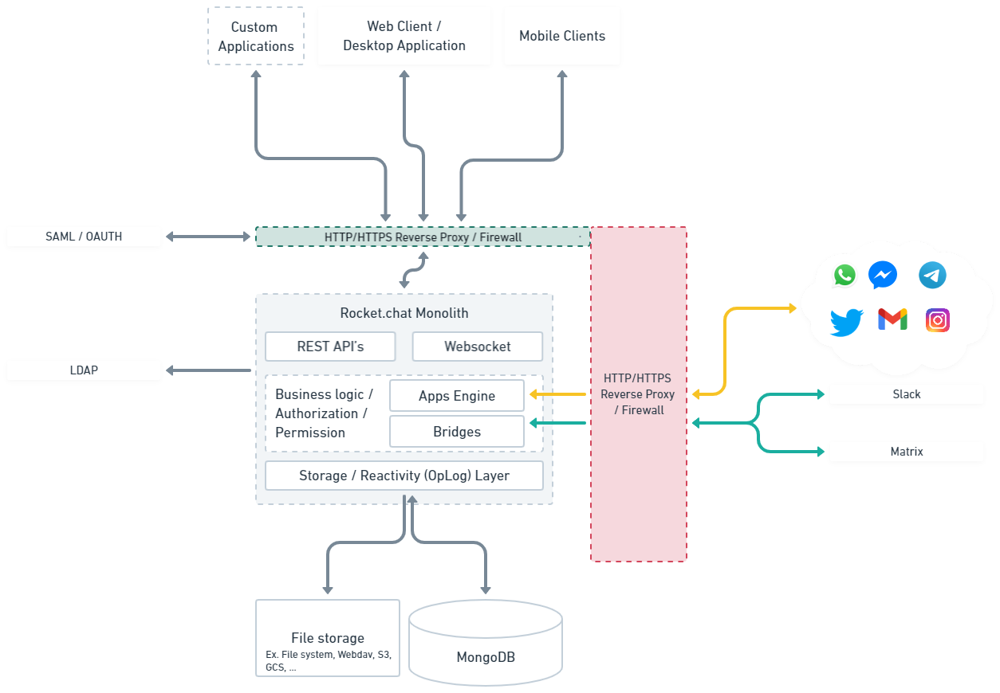

# Architecture and Components

The architecture of Rocket.Chat is based on a client-server model with the server component written in JavaScript using Node.js and the MongoDB database for data storage. It is designed for scalability, high performance, and real-time communication. It can be deployed on-premise or in the cloud, making it suitable for many use cases.

## Basic Components

<figure><figcaption>
Rocket.Chat architecture
</figcaption></figure>

### Server

The server manages the logic and computation, user accounts, message storage, and communication with other components.

### Clients

Rocket.Chat clients provide users with an interface on the web, using a desktop or mobile application in connecting with a server. Server communication with the clients is done mainly through HTTP requests and Websockets.

Push notifications are sent to mobile devices through a cloud [push notification gateway](../open-source-projects/mobile-app/mobile-app-white-labelling/configuring-push-notifications.md). SMTP and email notifications can be configured.

### Apps, Integrations, and Bridges

**Rocket.Cht apps:** Apps are developed using the Apps Engine which is the medium of interfacing with the Rocket.Chat server. Examples include the [WhatsApp app](https://docs.rocket.chat/extend-rocket.chat-capabilities/rocket.chat-marketplace/rocket.chat-public-apps-guides/omnichannel-apps/whatsapp) and [Google Calendar app](https://docs.rocket.chat/extend-rocket.chat-capabilities/rocket.chat-marketplace/rocket.chat-public-apps-guides/google-calendar).

**Integrations:** Allows for integrating other external systems and services using APIs and webhooks. A list of common integrations can be seen [here](https://docs.rocket.chat/use-rocket.chat/workspace-administration/integrations).&#x20;

**Bridge services:** Provides a way of seamlessly transmitting data and conversation with different conversational platforms or protocols. Rocket.Chat implementation currently supports bridging with the Matrix protocol, see [Matrix Bridge](https://docs.rocket.chat/use-rocket.chat/workspace-administration/settings/federation/matrix-bridge).

### Authentication and Authorization

User authentication, authorization, and access control can be managed using open standard protocols like [OAuth](https://oauth.net/), [SAML](https://docs.rocket.chat/use-rocket.chat/workspace-administration/settings/saml), [LDAP](https://docs.rocket.chat/use-rocket.chat/workspace-administration/settings/ldap), and OpenID.

### Database and Storage

**Database**: Rocket.Chat server uses MongoDB as a database to store all chat messages, user information, and other system configurations and related data.

**File Storage**: Files like assets, user files, images, and other media files are stored locally on the system running the server or over network services like Amazon S3, and WebDAV.

### WebSocket

Rocket.Chat uses the WebSocket protocol to enable real-time communication between the client and server. The WebSocket protocol is a high-performance, bi-directional communication protocol that enables instant data transfer.
