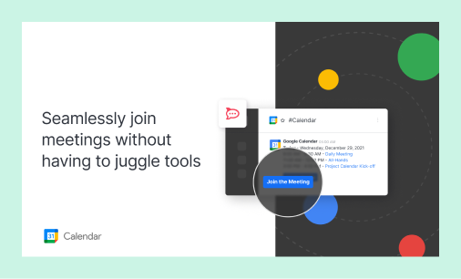

# iOS App White Labelling

## General setup

* Open [RocketChatRN.xcworkspace](https://github.com/RocketChat/Rocket.Chat.ReactNative/tree/single-server/ios/RocketChatRN.xcworkspace) on Xcode (13.0 or newer)
* On the General tab, select “RocketChatRN” and change Display Name, Bundle Identifier, Version and Build


As explained in the [Important section](https://developer.rocket.chat/mobile-app/mobile-app-white-labelling#important), we have two targets and we're going to cover the default one on this doc, which is the Experimental app.


* Select “ShareRocketChatRN” and change the same properties
  * `Display Name` and `Bundle Identifier` are different from the previous target
  * `Version` and `Build` must be the same on all targets

* Select “NotificationService” and change the same properties
  * `Display Name` and `Bundle Identifier` are different from the previous target
  * `Version` and `Build` must be the same on all targets

* On Signing and Capabilities, check “Automatically manage signing”, select your app group and add a keychain group

* Select “ShareRocketChatRN”, check “Automatically manage signing”, select your app group and add the same keychain group

* Select “NotificationService”, check “Automatically manage signing”, select your app group and add the same keychain group

* Set the same app group on `RocketChatRN/Info.plist`, `ShareRocketChatRN/Info.plist` and `NotificationService/Info.plist`

 (1) (3) (3) (3) (3) (2).png>)

* Set the same keychain group on `RocketChatRN/Info.plist`, `ShareRocketChatRN/Info.plist` and `NotificationService/Info.plist`

.png>)

.png>)

.png>)

* It needs to be the same on all entitlements

.png>)

.png>)

.png>)

* Change the app icon on `Experimental.xcassets/App Icon`

 (3) (3) (3) (3) (3) (2) (3).png>)

* Change the app splash screen on `Experimental.xcassets/Launch Screen Icon`

.png>)

* Change the splash background colors on `Experimental.xcassets/splashBackgroundColor`

.png>)

* Set your Bugsnag API key on `RocketChatRN/Info.plist`

## Generating iOS app on Firebase

* Visit the project overview on [https://console.firebase.google.com](https://console.firebase.google.com)
* Click on the gear icon and then “Project settings”

* On “General” tab, click on “iOS” button under “Your apps” section

* Enter your bundle ID and then “Register app”

* Download config file and move it as instructed

* Add it to all targets

.png>)

## Running the app

* Execute the following on project terminal
  * `yarn`
  * `npx pod-install`
  * `yarn ios`

## Configuring the Apple Developer Portal

### Login to Apple Developer Portal

* Visit [https://developer.apple.com/account](https://developer.apple.com/account/resources/certificates/list)
* Enter your credentials
* Click on Certificates, Identifiers & Profiles

### Creating an App Identifier

* Visit [https://developer.apple.com/account/resources/identifiers/list](https://developer.apple.com/account/resources/identifiers/list)
* Click to add Identifier
* Select App IDs and Continue

* Add description and Bundle ID

* On Capabilities, select App Groups and Push notifications
* Click “Continue” and then “Register”

### Creating an App Identifier for our Share Extension

* Share Extension is a version of the app that opens when you share data from another app to Rocket.Chat. For example, share a photo from the gallery.
* Visit [https://developer.apple.com/account/resources/identifiers/list](https://developer.apple.com/account/resources/identifiers/list)
* Click to add Identifier
* Select App IDs and Continue

* Add description and Bundle ID

* This time, select only App Groups under Capabilities
* Click “Continue” and then “Register”

### Create an App Identifier for our Notification Service

.png>)

### Creating an App Group

* Visit [https://developer.apple.com/account/resources/identifiers/list](https://developer.apple.com/account/resources/identifiers/list)
* Click to add Identifier
* Select App Groups and Continue

* Enter a description and an Identifier

* Click “Continue” and then “Register”

### Applying App Group

* Visit [https://developer.apple.com/account/resources/identifiers/list](https://developer.apple.com/account/resources/identifiers/list)
* Click on the first identifier you created
* On “App Groups”, click “Configure”
* Select the App Group you created and click “Continue”
* Click “Save”
* Repeat these steps for the second identifier you created for the Share Extension and NotificationService

### Creating Push Notifications certificates

* Visit [https://developer.apple.com/account/resources/identifiers/list](https://developer.apple.com/account/resources/identifiers/list)
* Click on the first identifier you created
* On “Push Notifications”, click “Configure”

#### Development SSL Certificate

* On “Development SSL Certificate”, click “Create Certificate”
* Follow Apple’s tutorial to generate a Certificate Signing Request: [https://help.apple.com/developer-account/#/devbfa00fef7](https://help.apple.com/developer-account/#/devbfa00fef7)
* Select the certificate you created and click “Continue”

* Download the certificate and install it on your machine (follow the instructions on the screen)

* After installing it, “Keychain Access” should have opened automatically on your Mac
* Export the certificate to generate a .p12 file

* For simplicity, save it in the same folder of your CSR and .cer. You’ll need it later.

#### Production SSL Certificate

* On “Production SSL Certificate” click “Create Certificate”
* Follow Apple’s tutorial to generate a Certificate Signing Request: [https://help.apple.com/developer-account/#/devbfa00fef7](https://help.apple.com/developer-account/#/devbfa00fef7)
* Select the certificate you created and click “Continue”

* Download the certificate and install it on your machine (follow the instructions on the screen)

* After installing it, “Keychain Access” should have opened automatically on your mac
* Export the certificate to generate a .p12 file

* For simplicity, save it in the same folder of your CSR and .cer. You’ll need it later.
